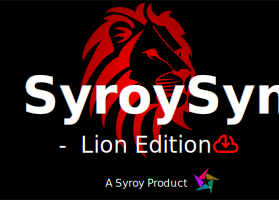

# SyroySync

## Disclaimer

This software is a user interface tool designed solely to simplify the configuration of download settings — such as format selection, thumbnail embedding, and batch converting — for content you are legally permitted to download. It does not condone, encourage, or facilitate illegal downloading of any kind.

**What this app is for:**

- Simplifying format and quality selection
- Embedding thumbnails and metadata
- Converting and downloading multiple files in one go
- Downloading content you are legally permitted to save

**Examples of legal use:**

- Content from platforms that explicitly allow downloading (e.g. Archive.org, Wikimedia, media.ccc.de)
- Content licensed under Creative Commons or other open licenses
- Content you have purchased and are permitted to save offline
- Your own uploaded content

**What is not allowed:**

- Downloading copyright-protected videos from YouTube or similar platforms without explicit permission
- Downloading paid content without a valid license or purchase
- Circumventing DRM or access restrictions
- Any use that violates the terms of service of the respective platform

**Important — User Responsibility for Download Sources:**

This application does not initiate, manage, or control any downloading process directly. The user is solely responsible for providing and configuring the appropriate download functions and sources. The developers have no visibility into, or control over, what sources the user connects to this interface. Any downloading activity is entirely the user's own action and responsibility.

**Please note:** Copyright and downloading laws vary by country. What may be permitted in one jurisdiction may be illegal in another. It is your sole responsibility to ensure your use of this software complies with the laws of your country and the terms of service of any platform you access. The developers of this software assume no liability for any misuse.

---

## Third-Party Tools

SyroySync uses [yt-dlp](https://github.com/yt-dlp/yt-dlp) and [FFmpeg](https://ffmpeg.org/) as backend tools for media processing.

**These tools are included in the release for convenience only.**
The developers of SyroySync are not affiliated with, endorsed by, or responsible for yt-dlp or FFmpeg in any way. These tools are separate projects with their own licenses and terms of use.

### Bring Your Own Tools

You are not required to use the bundled versions. SyroySync supports pointing to your own installations of yt-dlp and FFmpeg via the settings page. This is the recommended approach if you have specific version requirements or prefer to manage the tools yourself.

You can download them directly from their official sources:
- **yt-dlp**: https://github.com/yt-dlp/yt-dlp/releases/latest
- **FFmpeg**: https://ffmpeg.org/download.html

### Licensing

- yt-dlp is licensed under the [Unlicense](https://github.com/yt-dlp/yt-dlp/blob/master/LICENSE)
- FFmpeg is licensed under [GPLv3](https://www.gnu.org/licenses/gpl-3.0.html) (the bundled build) — see [FFmpeg Legal](https://ffmpeg.org/legal.html) for details
- SyroySync itself is licensed under [GPLv3](LICENSE) as required by the included FFmpeg build

---

## Acknowledgements

### Libraries & Tools

- [yt-dlp](https://github.com/yt-dlp/yt-dlp) — Media downloading backend
- [FFmpeg](https://ffmpeg.org/) — Audio/video processing and conversion
- [Qt6](https://www.qt.io/) — Application framework

### Image Credits

| File | Source | Author |
| ---- | ------ | ------ |
| API.png | [Flaticon](https://www.flaticon.com/de/kostenloses-icon/api_2164832) | Flaticon |
| API\_background.jpg | [Magnific](https://www.magnific.com/free-vector/modern-abstract-dark-violate-pink-background_159480835.htm) | Magnific |
| Browser.png | [Flaticon](https://www.flaticon.com/de/kostenloses-icon/web-browser_8576378) | Flaticon |
| Website.png | [Flaticon](https://www.flaticon.com/free-icon/domain_7710466) | Flaticon |
| input\_overview\_background.jpg | [Unsplash](https://unsplash.com/photos/T-LfvX-7IVg) | Unsplash |
| male\_lion.jpg | [PNGTree](https://nl.pngtree.com/freebackground/lion-portrait-on-savanna-mount-kilimanjaro-landscape-background-and-at-sunset-panoramic-version_15780706.html) | PNGTree |
| loading\_background.jpg | [Pixabay](https://pixabay.com/photos/10064513) | Carla Manneh - Rombout |
| Settings\_background.jpg | [Pixabay](https://pixabay.com/photos/lion-cub-feline-animal-1305797/) | Tobi (chillervirus) |
